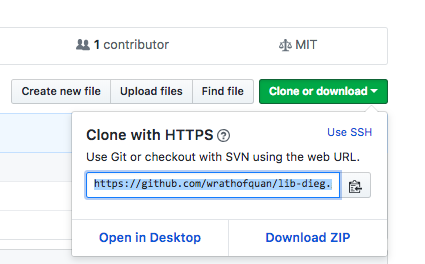
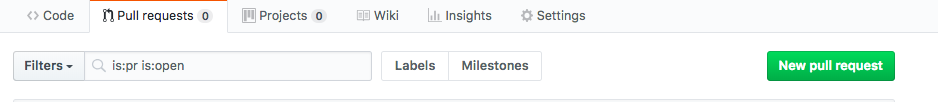

## Git for Data Initiatives Expertise Group

> Objectives
- Differentiate between Git and Github
- Know what a _repo_ is
- See how commands like:  _status_, _add_, _commit_, _push_,  _fetch_, _merge_ are used

## *What* is Git & Github

- Version Control: Like *undo*  and *history* with superpowers

- Git: The language

- Github: A service for the language

- Available in different desktop GUIs

- [Github Desktop](https://desktop.github.com)


## So, *What*

- Tools like this advance transparency in software and data analysis.

- This is how many researchers and leaners who code in your domains work and will work in the foreseeable future

- More and more librarians use Git for their own projects

- More and more librarians introduce Git as a workflow/management solution to their researchers.

- You can work offline

- You can time-travel and go to different states of your work infinitely.


## *What's* Next?

- Use Git to update our DIEG teach-Ins. Together, we'll troubleshoot and learn in a way that allows us to use Git in a simplified, immediately usable way.

- [Library Carpentries lesson](https://librarycarpentry.github.io/lc-git/)

- [Git Guide, "No deep shit"](http://rogerdudler.github.io/git-guide/)


## Example workflows

<br>


<details>

<summary> Collaborate using "pull requests": command line</summary>

<br>

- Sign up for [Github](https://github.com/join)

- Download [Git](https://git-scm.com/downloads). (Already on Unix/OSX)

- Go to our [DIEG Repo](https://github.com/wrathofquan/lib-dieg)

- Click on 'Fork' 
  - this will make a copy to your Github account


- Copy the https link 

- Open terminal or cmd (on windows)

- ```git clone https://github.com/wrathofquan/lib-dieg.git```
  - This takes your copy of the original and puts it on your computer.


-  Make some changes to the files.

- ```git add name_of_file_you've_changed ```

  - Tell git to track your change


- ```git commit -m "a quick descriptive message of what you did"```

  - Tell git you're serious about this change


- ```git push origin master```

  - Tell git to send your changes to **your** Copy


- Go to your **forked** copy and make a new pull request to the owner of the original



- Review your changes and submit!


<details>

<summary> Fetch, merge, pull...</summary>

- When you are working on your own clone, others will be working on their own clones too! If you attempt to push your own changes without being up to date with your colleague's changes then git will tell you something like this:

``` ! [rejected]        master -> master (fetch first)
error: failed to push some refs to 'https://github.com/wrathofquan/lib-dieg.git'
hint: Updates were rejected because the remote contains work that you do
hint: not have locally. This is usually caused by another repository pushing
hint: to the same ref. You may want to first integrate the remote changes
hint: (e.g., 'git pull ...') before pushing again.```

- ```git fetch origin```

- ```git diff master origin/master```

-```git merge origin```
